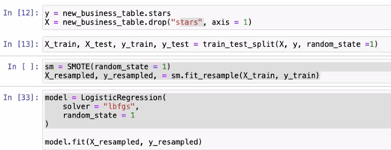
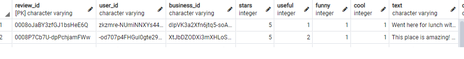

# Restaurant Business Analysis

The purpose of this project is to find the most popular restaurants across cities with regards to the review ratings provided by customers, and to use different machine learning models to predict the accuracy of customer review ratings.

## Reason Why We Selected Our Topic

With this project, we want to be able to help people search the best restaurants in a particular category in a particular city.

## Description of the Source of Data

The Dataset came from [Yelp](https://www.yelp.com/dataset). It contains 5 different json data files out of which we are just taking ```business.json``` and ```review.json``` files for our analysis. The rest of the data is out of scope for our analysis.

- The ```business.json``` file contains business data including location data, attributes, categories and star ratings for the restaurants.
- The ```review.json``` file contains review data including the user_id who wrote the reviews, the business_id  for which the review is written and the star reviews for each of the restaurant.

## Questions to be Answered With the Data

- Are the star ratings correct based on number of reviews and other attributes?
- Can we predict the average review per city per category?
- What is the percentage for positive and negative reviews per city per category?
- What are the top 5 restaurants in a city?

## Communication Protocols

```Zoom``` and ```Slack``` are the communication platforms used for discussion on the project. Meetings are conducted several times a week to assign project tasks, decide on technologies to be used and solve any challenges encountered during the process.

## Provisional Machine Learning Model

[Link to Folder](https://github.com/abtieku/group4-project/tree/main/Machine_Learning)

Python Libraries, PySpark and Google Collab will be used for machine learning. 

We will use a supervised learning model. In this example, we are experimenting with SMOTE. This is one of the models we will review before determining which one(s) we will use:

 

## Provisional Database 

We extracted restaurants out of the business data, and here is a sample of that table:

 

Here is a sample of the review table data:

 

Here is the database schema:
 

## Data Cleaning and Analysis

Pandas will be used to clean the data and perform an exploratory analysis. Further analysis will be completed using PySpark.

## Database Storage

PostgreSQL is where data is stored and is hosted on the Google Cloud Platform.

## Dashboard

Tableau will be used to create interactive dashboards.

[Link to Folder](https://github.com/abtieku/group4-project/tree/shanu_segment2/Dashboard/Tableau)
