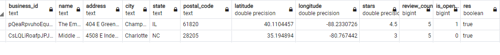
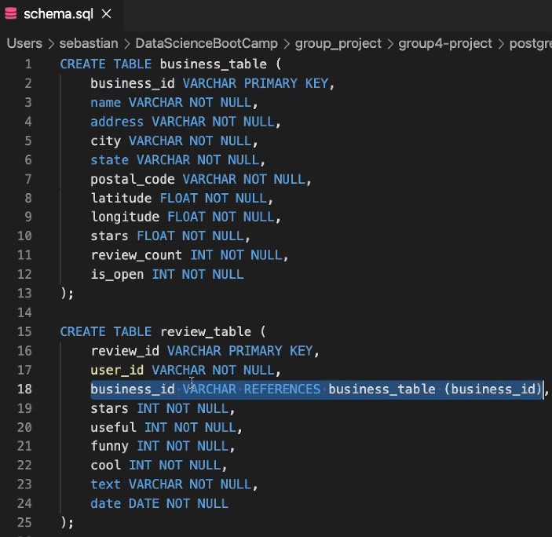

# Restaurant Business Analysis
 
This project will use Machine Learning Algorithms and Models to predict the success of a Restaurant based on features including location, ambience, food, etc.
 
 
## Reason Why We Selected Our Topic
 
With this project, we want to be able to help people search the best restaurants in a particular category in a particular city.
 
## Description of the Source of Data
 
The Dataset came from [Yelp](https://www.yelp.com/dataset). It contains 5 different json data files out of which we are just taking the ```business.json```
- The ```business.json``` file contains business data including location data, attributes, categories and star ratings for the restaurants.
 
## Questions to be Answered With the Data
 
- What Features makes a Restaurant successful
- Can we accurately predict the success of a restaurant given these features
- What is the percentage for positive and negative reviews per city per category?
- What are the top 5 restaurants in a city?
- Can we accurately classify a restaurant by star rating given these features
 
## Communication Protocols
 
```Zoom``` and ```Slack``` are the communication platforms used for discussion on the project. Meetings are conducted several times a week to assign project tasks, decide on technologies to be used and solve any challenges encountered during the process.
 
## Provisional Machine Learning Model
 
We have been entertaining the idea of incorporating a Neural Network to predict the star rating of a restaurant based on features such as food served, noise level, location etc. The second viable option in mind is to create a model predicting the success of a restaurant based on these same features or attributes utilizing a polynomial linear regression. Information for Both Models as well as a README.md is located in the link provided below
 
[Machine Learning Group 4](https://github.com/abtieku/group4-project/tree/main/Machine_Learning)
 
 
## Database
 
We extracted restaurants out of the business data json file, and here is a sample of that table:
 

 
 
Here is the database schema:

 
## Data Cleaning and Analysis
 
Python Pandas,sklearn, and tensorflow libraries will be used to clean the data,perform an exploratory analysis, and build our Machine learning models.
 
## Database Storage
 
PostgreSQL is where data is stored and is hosted on the Google Cloud Platform.
 
## Dashboard
 
Tableau will be used to create interactive dashboards.
 
Dashboards provided in the link below
 
[Tableau Dashboards Group 4](https://github.com/abtieku/group4-project/tree/shanu_segment2/Dashboard/Tableau)
 


